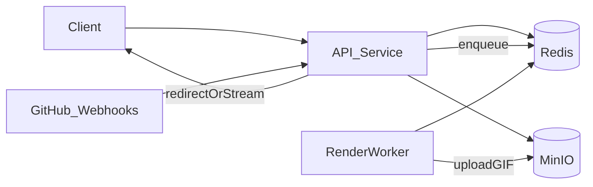

# Unify into a single Railpack app

## Current architecture (what exists today)

- **Web API**: `packages/server/src/index.ts` serves Hono endpoints and enqueues BullMQ jobs.
- **Worker**: `packages/server/src/workers/render-worker.ts` consumes BullMQ jobs and runs Remotion render (Chromium + ffmpeg) then uploads to MinIO.
- **Stateful dependencies**: Redis (BullMQ + cache) and MinIO (GIF storage).

## Target end state on Railpack

### Deployment model (your selection)

- **One Railpack “app/project”, two process types**:
  - **web**: runs the API server
  - **worker**: runs the BullMQ render worker
- **No Docker Compose required**: Railpack builds the image once; the platform runs two services from it.

### Keep MinIO (your selection), but make the API the only public surface (recommended)

Right now production wants *two public domains*: API + MinIO (`DEPLOYMENT.md`). You can simplify ops by keeping MinIO **internal-only** and serving GIFs via the API domain:

- Add an **asset proxy route** in the API that streams objects from MinIO with proper cache headers.
- Change cached/returned URLs to point at the API’s asset route (so only **one public domain** is required).

## What I would change in the repo

### 1) Add an API “asset proxy” endpoint (single public domain)

- **Add route** like `GET /assets/images/:username/:composition.gif` (or `GET /assets/*`) in a new route file (e.g. [`packages/server/src/routes/assets.ts`](packages/server/src/routes/assets.ts)), mounted from [`packages/server/src/index.ts`](packages/server/src/index.ts).
- It should:
  - Use existing MinIO helpers in [`packages/server/src/services/storage.ts`](packages/server/src/services/storage.ts) (`getImageStream`, `getImageStats`).
  - Set `Content-Type: image/gif`, `Cache-Control`, and optionally `ETag` / `Last-Modified`.

### 2) Point “public URLs” at the API instead of MinIO

- Adjust [`packages/server/src/services/storage.ts`](packages/server/src/services/storage.ts) so the “public URL” for an image can be the API asset route (still backed by MinIO).
  - Practical approach: keep `PUBLIC_URL` but interpret it as **the public base URL for assets**, e.g. `PUBLIC_URL=https://api.example.com` and then return `${PUBLIC_URL}/assets/${key}`.
  - This avoids needing `MINIO_DOMAIN` publicly at all.
- Update API caching in [`packages/server/src/services/queue.ts`](packages/server/src/services/queue.ts) usage sites so cached URLs are the API asset URLs.

### 3) Railpack deployment wiring (no compose)

- Keep using the existing Bun+system-deps image build ([`packages/server/Dockerfile`](packages/server/Dockerfile) already installs Chromium/ffmpeg).
- In Railpack/Railway:
  - **Service “api”** start command: `bun run packages/server/src/index.ts` (current default)
  - **Service “worker”** start command: `bun run packages/server/src/workers/render-worker.ts`
  - Add **Redis** and **MinIO** as attached services; set `REDIS_URL`, `MINIO_ENDPOINT`, etc.
  - Make **only the API service public**; keep MinIO private.

### 4) Update docs to match the new model

- Update [`DEPLOYMENT.md`](DEPLOYMENT.md) to remove the requirement for a public MinIO domain when using the asset proxy.
- Add a short “Railpack/Railway” section describing the two process types and required env.

## Key risks / considerations

- **CPU/memory**: Remotion rendering is heavy; keeping worker separate (as you chose) is good.
- **Horizontal scaling**: multiple worker replicas are fine, but watch GitHub API rate limits and CPU; tune `RENDER_CONCURRENCY`.
- **Bandwidth**: proxying GIFs through the API increases API egress; if that’s a concern, you can still keep MinIO public and keep redirects.